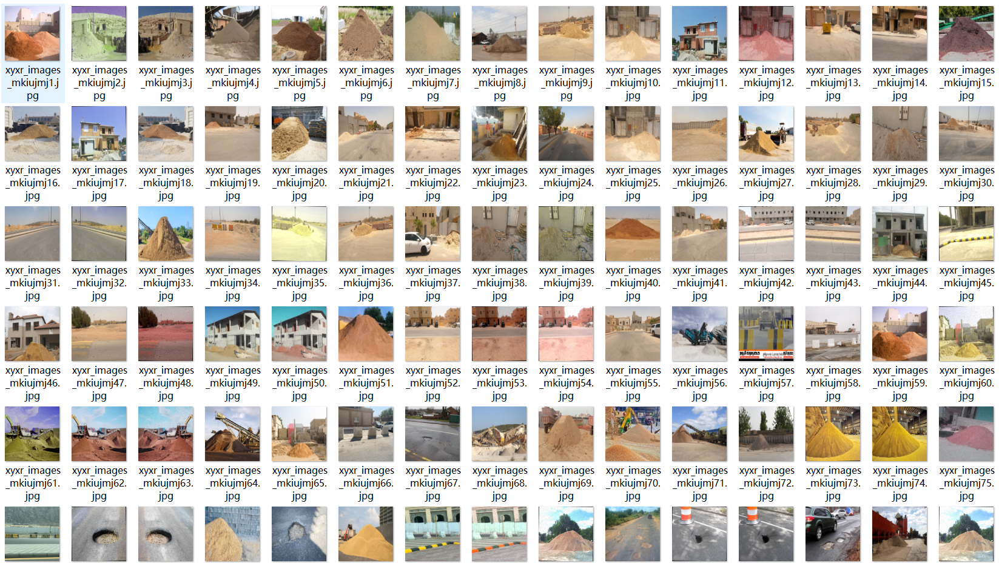
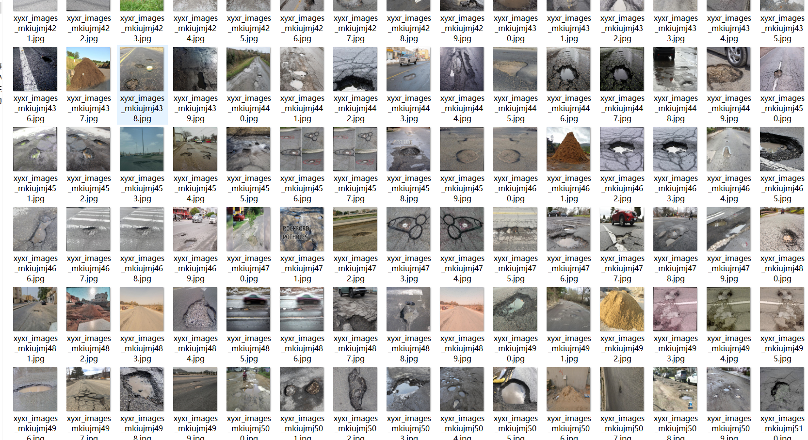

# Sand Pile Concrete Guardrail Pothole Detection Dataset 3418 Images VOC+YOLO Format

The Sand Pile Concrete Guardrail Pothole Detection Dataset consists of 3418 images in VOC+YOLO format, organized into three folders: JPEGImages, Annotations, and labels. The JPEGImages folder contains a total of 3418 jpg images. The Annotations folder includes a total of 3418 xml files for annotations. Similarly, the labels folder contains a total of 3418 txt files. There are a total of 3 label categories: "Concrete barriers", "potholes", and "sand on road". Each category has a corresponding number of boxes (yolo format) as listed below:

- "Concrete barriers": 6536 boxes
- "potholes": 1731 boxes
- "sand on road": 1389 boxes

The total number of boxes is 9656. All images are of high resolution clarity. The images have not been enhanced. The repository location for this dataset is datasets_sl. The shape of the labeled boxes used for target detection recognition is a rectangle box.

This dataset does not guarantee the accuracy or precision of any trained models or weight files. It only provides accurate and reasonable annotations. Please note that there are no specific instructions provided here.

Special Note: This dataset does not guarantee any accuracy or precision for the trained models or weight files. It only provides accurate and reasonable annotations.

Notes about the Annotation and Image Conditions:

## Images

---

Here is a pay link on Stripe (https://buy.stripe.com/3cs8yP7sY87d0vu9AB). Please contact me lonlonago@foxmail.com after funding $89, and I will send you a complete data files, thank you!

